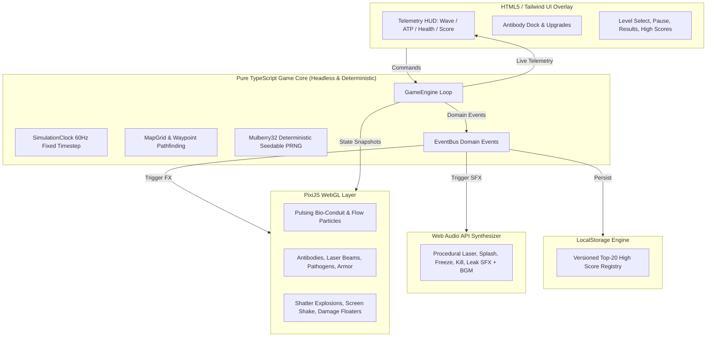

# CYBER-IMMUNOLOGY: NEON MICROCOSM
### High-Performance WebGL Tower Defence Game

[](https://www.typescriptlang.org/)
[](https://vitejs.dev/)
[](https://pixijs.com/)
[](https://vitest.dev/)
[](https://playwright.dev/)

**Cyber-Immunology: Neon Microcosm** is a fast-paced, high-performance browser tower defence game built for the hackathon. Protect the human vascular network from invading geometric viral pathogens by synthesizing specialized antibody sentinels and cellular bio-defenses.

---

## 🎮 Live Game Controls

| Key / Action | Function |
| :--- | :--- |
| **`1` - `4`** | Select Antibody Tower for placement (IgG, IgM, IgA, Killer T) |
| **Left Click** (on map node) | Place selected antibody tower / Select placed tower to inspect |
| **Right Click / `Esc`** | Deselect active placement mode / Close tower inspector |
| **`Space`** | Toggle Game Pause |
| **Speed Toggle (`1x`, `2x`, `3x`)** | Change simulation tick speed |
| **`⚡ SEND NOW`** | Early Wave Call (awards bonus ATP and score based on remaining time) |

---

## 🧪 Antibody Tower Deep-Dive & Mechanics Comparison

Every antibody has a unique combat identity, firing mode, target tracking algorithm, and branching specialization path. Choosing the right antibody composition and placement geometry is key to mastering the game.

| Antibody Tower | Role | Cost | Range | Base Damage | Attack Interval | Firing Style | Best Target / Counter |
| :--- | :--- | :--- | :--- | :--- | :--- | :--- | :--- |
| **IgG Pulse Sentinel** (`#00F5FF`) | Rapid Kinetic | ⚡ 100 | 120px | 15 | 350ms (2.85/s) | High-speed bio-photon projectiles | Fast runners (**Rhinovirus**) & stragglers |
| **IgM Cluster Cannon** (`#D946EF`) | Area-of-Effect Burst | ⚡ 150 | 140px | 45 | 1200ms (0.83/s) | Arcing bio-plasma cluster bomb (65px blast radius) | Dense swarms (**Influenza**, boss split packs) |
| **IgA Cryo-Tether** (`#10B981`) | Cryo Control & Debuff | ⚡ 125 | 110px | 8 | 250ms (4.0/s) | Continuous sub-zero bio-tether + 40% slow | Slowing high-threat units in kill zones |
| **Killer T-Cell Prism** (`#FBBF24`) | Precision Thermal Laser | ⚡ 225 | 180px | 20 | 200ms (5.0/s) | Continuous locked beam ramping up to 5x dmg | Heavy armor & bosses (**Corona Titan**, **Retro-Mutant**) |

---

### Detailed Tower Breakdown & Upgrade Paths

#### 1. 🩵 IgG Pulse Sentinel (Rapid Kinetic)
- **Mechanics**: Fires focused bio-photons with instant projectile speed. Excellent value for early waves and picking off swift pathogens.
- **Target Mode**: Defaults to `FIRST`.
- **Branch A — Hyper-Gatling (⚡ 150)**: Overclocks photon synthesis for +60% fire rate and a 25% critical strike chance. Transforms the tower into a single-target shredder.
- **Branch B — Chain Pulse (⚡ 160)**: Photons ionize upon impact, arcing to hit up to 3 nearby pathogens. Great for hybrid single-target and multi-target coverage.
- **Master Tier 3 (⚡ 220–240)**: Unlocks apex damage multipliers (+50–60%) for endgame wave scaling.

#### 2. 💜 IgM Cluster Cannon (Area Burst)
- **Mechanics**: Launches dense bio-plasma shells that explode on impact, dealing full damage to every enemy inside the 65px blast radius.
- **Target Mode**: Defaults to `FIRST` (aiming at clustered leads).
- **Branch A — Plasma Rupture (⚡ 200)**: Expands explosion radius by 50% and leaves a lingering acidic bio-field dealing Damage-over-Time.
- **Branch B — Cluster Shells (⚡ 220)**: Main shell fragments into 4 secondary explosive sub-munitions on impact, saturating the lane.
- **Master Tier 3 (⚡ 280–300)**: Massive +60–70% blast damage escalation.

#### 3. 💚 IgA Cryo-Tether (Cryogenic Slow & Debuff)
- **Mechanics**: Establishes an active cryogenic tether to pathogens within range, applying steady damage and reducing their movement speed by 40% (clamped up to 80% maximum slow across stacks).
- **Target Mode**: Defaults to `FIRST`.
- **Branch A — Deep Freeze (⚡ 175)**: Deepens slow up to 70% and inflicts *Brittle*, causing the target to take +25% amplified damage from all other towers.
- **Branch B — Glacial Aura (⚡ 190)**: Projects an omnidirectional 360-degree cryogenic field that continuously chills all enemies entering its perimeter.
- **Master Tier 3 (⚡ 250–260)**: Extended freeze duration and increased cellular breakdown.

#### 4. 💛 Killer T-Cell Prism (Priority Thermal Laser)
- **Mechanics**: Focuses an intense thermal laser onto a high-threat pathogen. While locked on the same target, thermal damage ramps continuously from 1x up to 5x (over 3 seconds). If the target dies or leaves range, the ramp resets.
- **Target Mode**: Defaults to `STRONGEST` (automatically locks onto bosses and armored Titans).
- **Branch A — Focused Ion Lance (⚡ 260)**: Thermal ramp cap boosted to 8x with accelerated ramp spool time. Essential for neutralizing the wave 10 Retro-Mutant boss.
- **Branch B — Multi-Prism Beam (⚡ 280)**: Prism splits into 3 concurrent high-power laser beams, incinerating multiple heavy targets at once.
- **Master Tier 3 (⚡ 350–360)**: +60–80% thermal base damage increase.

---

## 🎯 Master Strategy Guide: Playing to Maximum Capabilities

### 1. The "Kill Zone" Chokepoint Strategy
Never place towers randomly along the path. Construct concentrated **Kill Zones** at sharp curves or intersections:
1. **Frontline Control**: Place an **IgA Cryo-Tether** at the entry of the turn to clump oncoming viruses together.
2. **Cluster Bombardment**: Place an **IgM Cluster Cannon** covering the center of the curve where slowed viruses cluster.
3. **Heavy Sniping**: Position a **Killer T-Cell Prism** behind the curve with full line-of-sight along the straightaway to maximize continuous beam lock time.
4. **Cleanup Gate**: Place an **IgG Pulse Sentinel** (upgraded to Hyper-Gatling) right at the exit of the turn to finish low-HP runners.

### 2. High-Score Maximization: "Send Early" Greed Mechanics
- The **`⚡ SEND NOW`** button skips the remaining preparation countdown and calls the next wave immediately.
- **Reward Formula**: Awards **+3 ATP** and **+25 Score** per second skipped (scaled by difficulty multiplier).
- **Pro Tip**: Calling wave 1 immediately grants an instant **+36 ATP** boost, letting you place your second tower before wave 1 even reaches your kill zone!

### 3. Countering Specific Pathogen Types
- **Rhinovirus (Fast Runner)**: Do not rely on IgM (slow shells may miss or lag). Use **IgG Pulse Sentinels** or **IgA Cryo-Tethers** to reduce their speed.
- **Corona Titan (Armored)**: Titans have flat armor reduction per strike. Low-damage, high-cadence attacks are less effective. Use **Killer T-Cell Prisms** (whose ramped thermal damage easily punches through armor) or upgraded **IgM Cluster Cannons**.
- **Retro-Mutant Boss (Splitter)**: On death, the boss ruptures into 4 swift Rhinoviruses at that exact spot on the track. Ensure you have an **IgM Cluster Cannon** ready near the boss takedown point to instantly vaporize the 4 split children with splash damage!

### 4. Economy & Selling Optimization
- Selling an antibody refunds **70% of total invested ATP** (base cost + all upgrades).
- In the early game, place basic towers to survive, then sell and re-invest in high-tier specialized branches (such as Tier 3 Killer T-Cells) for boss waves.
- You can change a tower's targeting priority at any time (`FIRST` ⇄ `STRONGEST`) by clicking the tower to open the Inspector Panel.

---

## 🦠 Viral Pathogens (Enemies)

- **Rhinovirus**: High-speed kinetic runner with frail cellular membrane.
- **Influenza**: Balanced baseline viral colony with moderate HP and speed.
- **Corona Titan**: Armored heavy pathogen with flat damage reduction per hit.
- **Retro-Mutant Boss**: Apex mutagenic pathogen. On membrane rupture, splits into 4 swift Rhinovirus fragments.

---

## 🗺️ Sectors & Difficulty

- **Maps**:
  - `Vascular Run`: S-curve bloodstream conduit with balanced defensive curves.
  - `Lymph Spiral`: Inward winding lymphatic channel maximizing central tower coverage.
  - `Neural Fork`: Converging multi-path nerve sector.
- **Difficulties**:
  - `Resident` (Casual): Immune system in peak equilibrium. Higher starting ATP (450), +15% income.
  - `Acute` (Standard): Standard active viral infection. 350 starting ATP, balanced pathogen stats.
  - `Critical` (Hardcore): Severe multi-vector infection. 280 starting ATP, +25% enemy HP, +10% speed.

---

## 🏗️ Technical Architecture & Quality

The codebase enforces strict separation of concerns between deterministic headless game logic, WebGL rendering, Web Audio synthesis, and UI telemetry:



---

## 🚀 Setup & Execution Guide

### Prerequisites
- Node.js `v18+` or `v20+` (Tested on `v24.20.0`)
- npm `v9+` (Tested on `v11.19.0`)

### Installation
```bash
git clone <repo-url>
cd tower
npm install
```

### Run Development Server
```bash
npm run dev
```
Open [http://localhost:3000](http://localhost:3000) in your browser.

### Run Unit Tests (Vitest)
```bash
npm test
```

### Run Automated UI Tests (Playwright)
```bash
npm run test:e2e
```

### Build for Production
```bash
npm run build
npm run preview
```

---

## 🏆 Hackathon Feature Checklist

### Required Features (8/8 Complete)
- [x] **Playable map with defined enemy path**: Luminous vascular grid with continuous waypoint traversal and directional flow particles.
- [x] **Enemy spawning and wave progression**: 10 escalating wave definitions with timed spawn queues, composition previews, and countdowns.
- [x] **At least three tower types with different behaviours**: 4 distinct towers (IgG single rapid, IgM splash burst, IgA cryo slow, Killer T ramping laser).
- [x] **Tower placement and purchase mechanics**: Valid/invalid cell detection, range rings, ghost previews, Escape/right-click cancel.
- [x] **Currency system**: ATP bio-energy earned from kills, wave clear bonuses, and early wave sends; spent on towers and upgrades.
- [x] **Player health / lives system**: Organ Integrity (100%), core pulse effects, leak alerts, damage calculations.
- [x] **Win and lose conditions**: Distinct victory (`HOST STABILIZED`) and defeat (`ORGAN COMPROMISED`) terminal states.
- [x] **User interface showing wave, currency, score, and health**: Real-time HUD displaying all required metrics continuously.

### Optional & Bonus Features (7/7 Complete)
- [x] **Multiple enemy types**: Rhinovirus (runner), Influenza (swarm), Corona Titan (armored flat reduction), Retro-Mutant (splitting boss).
- [x] **Tower upgrades & branching paths**: Tier 1 upgrades, mutually exclusive Branch A/B specializations, Tier 3 Master Upgrades.
- [x] **Pause, restart, level selection**: Spacebar pause, 1x/2x/3x speed segment, in-game restart, level select modal.
- [x] **Multiple maps & difficulty levels**: 3 maps (Vascular Run, Lymph Spiral, Neural Fork) and 3 difficulties (Resident, Acute, Critical).
- [x] **Sound effects & music polish**: Pure Web Audio synthesizer (no external asset dependencies), procedural laser/splash/freeze SFX, ambient BGM.
- [x] **Score tracking & high score table**: Live score calculations, comprehensive post-game results breakdown, persistent LocalStorage high scores.
- [x] **Creative theme & art direction**: Cyber-Immunology neon bio-aesthetic, Syne Mono / Share Tech Mono / Rajdhani typography, zero gore.

### Technical Requirements (3/3 Complete)
- [x] **Architecture description**: Detailed modular breakdown and Mermaid diagram.
- [x] **Unit tests**: 25 Vitest tests covering clock, PRNG, map traversal, combat math, economy, upgrades, and terminal conditions.
- [x] **Automated UI tests**: Playwright end-to-end test suite testing full user journey, placement, upgrades, selling, and modal navigation.
