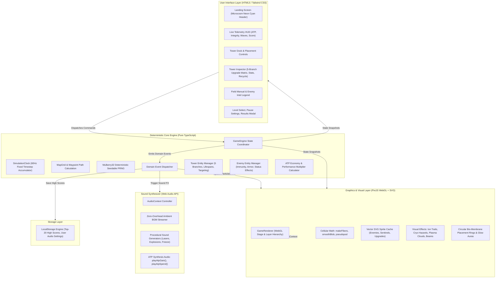

# Microcosm — System Architecture & Design

Version: 0.3.0  
Status: Active Reference  
Scope: Core Engine, WebGL Rendering, Biological SVG Pipeline, Web Audio Synthesis, UI Telemetry, and State Persistence.

---

## 1. High-Level Architectural Overview

Microcosm adheres to a strict unidirectional data flow and clean separation of concerns. The simulation engine runs in pure TypeScript without DOM or canvas dependencies, allowing 100% deterministic, headless execution for unit testing and reproducible game state.

---

## 2. Core Simulation Engine (`src/core/`)

### 2.1 Determinism & Fixed Timestep
- **`SimulationClock`**: Operates at a deterministic 60Hz tick rate (`16.67ms` per simulation tick). Uses a delta-time accumulator in `requestAnimationFrame` to ensure identical simulation behavior regardless of display refresh rate or client throttling.
- **`Mulberry32 PRNG`**: All probabilistic mechanics (critical strikes, particle scatter seeds, spawn variation) draw from a seedable PRNG. Provided identical seeds and player input sequences, gameplay replays produce bit-for-bit identical outcomes.

### 2.2 Command & Domain Event Architecture
All state mutations are driven by typed commands:
- `START_GAME`: Initializes session with selected map, difficulty, and PRNG seed.
- `PLACE_TOWER`: Validates cell buildability, charges ATP, and instantiates tower entities with organic circular placement footprints.
- `UPGRADE_TOWER`: Advances tower tier, applies dynamic performance discounts, and locks selected specialization branches.
- `RECYCLE_TOWER`: Sells/recycles an active tower, calculating depreciation, lifespan remaining, and refunding ATP.
- `SET_TARGET_MODE`: Modifies targeting priority (`FIRST`, `LAST`, `STRONGEST`, `WEAKEST`, `CLOSEST`).
- `TOGGLE_PAUSE`, `SET_SPEED`, `SEND_WAVE_EARLY`, `RESTART_GAME`.

State changes emit typed **Domain Events** (`TOWER_PLACED`, `ENEMY_DAMAGED`, `ENEMY_KILLED`, `WAVE_STARTED`, `WAVE_CLEARED`, `INTEGRITY_CHANGED`, `TOWER_RECYCLED`, `GAME_OVER`), enabling audio, renderer, and telemetry to react without modifying the core state machine.

---

## 3. Tower Ammunition & 5-Branch Upgrade Matrix

Microcosm expands antibody towers into a comprehensive 5-branch specialization matrix:

### 3.1 Base Tower Profiles
1. **IgG Pulse Sentinel**: High-velocity bio-photon spikes with ionization trails. Rapid kinetic projectile weapon countering fast runners.
2. **IgM Cluster Cannon**: Arcing bio-plasma cluster projectiles dealing radial burst damage and releasing secondary corrosive fragments.
3. **IgA Cryo-Tether**: Freezing goo globs and crystalline ice spikes applying stacking movement slows, brittle debuffs, and ground cryo-hazards.
4. **Killer T-Cell**: Continuous high-energy perforin thermal lance ramping up thermal damage against armored targets.

### 3.2 5-Branch Specialization Tree (`A` through `E`)
At Tier 3, each tower chooses from up to 5 mutually exclusive evolutionary branches, capped by an Apex Tier 4 upgrade:
- **Branch A — Kinetic Swarm**: Overclocks projectile cadence, adds critical strike chances, and creates multi-target ricochets.
- **Branch B — Cryo-Control**: Sub-zero temperature suppression, deep freezing, brittle status amplification, and persistent glacial auras.
- **Branch C — Corrosive Acid**: Armor-stripping bio-plasma, residual acidic pools, and exponential poison damage-over-time.
- **Branch D — Thermal Piercing**: Focused perforin lance with accelerated heat ramp-up, armor penetration, and cytotoxic novas.
- **Branch E — Phagocytic Engulfment**: Cellular tethering, enzymatic digestion, and bonus ATP bounty extraction upon neutralization.

---

## 4. Biological Sprite & Procedural Rendering Pipeline (`src/render/`, `src/ui/towerSprites.ts`)

### 4.1 Microscopy-Inspired Mathematical Algorithms
Rather than relying on raster graphics, Microcosm uses procedural cellular vector math:
- **`makeFibers(cx, cy, count, radius, seed)`**: Generates organic cytoskeletal fibril filaments connecting membrane nodes.
- **`smoothBlob(points, tension)`**: Computes smooth cubic Bezier splines through organic perimeter control points to render fluid cell membranes.
- **`pseudopod(angle, length, spread)`**: Generates dynamic cellular protrusions and amoeboid microvilli extensions.
- **Cytoplasmic Granule Distribution**: Simulates interior organelles, ribosomes, and glowing nuclei with additive alpha blending.

### 4.2 WebGL Rendering Layers (PixiJS 8)
1. **Background & Vascular Mesh**: Deep navy lumen with subtle tissue textures and drifting background micro-particles.
2. **Vascular Conduit Path**: Luminous cyan flow channel with animated velocity pulses indicating flow direction.
3. **Ground Hazard Layer**: Persistent cryo-ice slicks and corrosive bio-plasma pools left by specialized munitions.
4. **Placement Auras & Footprints**: Organic circular bio-membrane rings with pulsing glow auras indicating range and valid build sites.
5. **Entity Layer**: Antibodies, viral pathogens, membrane health bars, and status rings.
6. **Projectile & Beam Layer**: High-velocity bio-photon spikes, cluster shells, cryo tethers, and perforin thermal lances.
7. **Particle & FX Layer**: Shatter explosions, cytoplasmic splatter, floating damage numbers, and screen shake.

---

## 5. Audio Synthesizer Architecture (`src/audio/`)

Microcosm utilizes the Web Audio API with zero external audio assets required for primary gameplay:
- **`playAtpGain()`**: Melodic dual-oscillator chime triggered on ATP income, kill bounties, and wave clear rewards.
- **`playAtpSpend()`**: Resonant low-pass filtered synth thud triggered on tower purchases and branch upgrades.
- **Procedural Action SFX**: Distinct synthesis patches for laser fire, projectile launches, explosions, freeze debuffs, core leaks, and alerts.
- **Dual-Mode Ambient BGM**: Streams ambient background soundtrack (`/audio/soundtrack.mp3`) through audio nodes with procedural Celtic/Dorian modal synthesis fallback.
- **Browser Autoplay Compliance**: Automatically initializes audio on game launch with non-blocking fallback triggers on initial user gestures (click, keydown, touch).

---

## 6. UI & HUD Overlay (`src/ui/`)

- **Landing View**: Styled with `#00f5ff` neon-cyan typography and subheader `"a tower defense game."`.
- **Live Telemetry HUD**: Real-time display of current wave, ATP currency, organ integrity with animated EKG rhythm, game score, and speed controls.
- **Tower Dock & Inspector**: Displays antibody stats, active upgrade branches, performance discount indicators, and tactical recycling options.
- **Field Manual & Enemy Intel Legend**: Dynamic catalog of pathogen morphologies, armor levels, speeds, and tactical counters rendered with biological SVG sprites.
- **Modal System**: Level select, audio/video settings, in-game pause modal, and end-of-game victory/defeat breakdowns.

---

## 7. Testing Strategy & Quality Verification

Microcosm maintains 100% automated test coverage across all game logic:
- **Unit Tests (`tests/unit/`, Vitest)**: 98 unit tests covering:
  - Deterministic combat calculations, armor reduction, and status effects
  - 5-branch upgrade progression and apex damage scaling
  - ATP economy, dynamic bounties, and performance discounts
  - Simulation clock and Mulberry32 PRNG reproducibility
  - Web Audio synthesizer lifecycle, volume controls, and mute persistence
  - Map waypoint routing, path bounds, and multi-route convergence
- **End-to-End Tests (`tests/e2e/`, Playwright)**:
  - Full primary user journey: boot, level select, tower placement, wave dispatch, upgrades, and game completion.
  - UI modal verification, high-score rendering, and responsive viewport checks.
