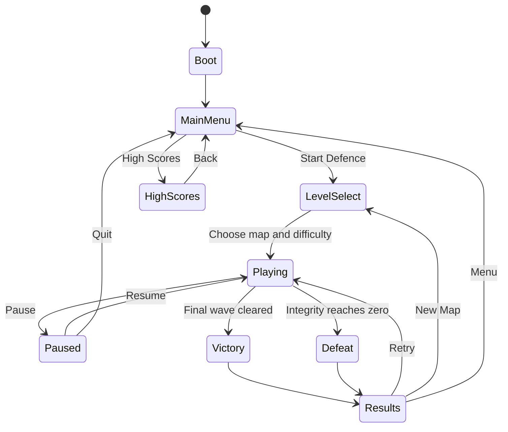
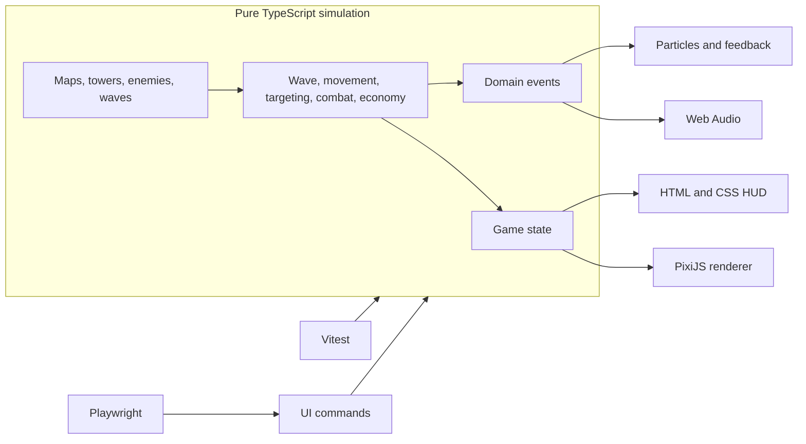

# Cyber-Immunology: Neon Microcosm

## Product Plan for Approval

Status: Approved  
Target: Playable browser tower defence game built during a 1.5-day hackathon  
Primary objective: Maximize demonstrated feature completion without sacrificing a reliable core game loop

Implementation backlogs: [Feature Decomposition](FEATURES.md), [User Stories](USER_STORIES.md), and [Incremental Tasks](TASKS.md)

## 1. Product Vision

The player protects a stylized body system from waves of luminous viruses by directing immune-cell towers along a flowing biological pathway. The visual language combines microscopy-inspired cellular forms, translucent membranes, soft organic texture, neon lighting, and laboratory telemetry without gore or realistic anatomy.

The game should be understandable within 30 seconds, playable in short sessions, and polished enough for a five-minute live demonstration.

### Art Direction

- Display font: Syne Mono for the title, wave announcements, and result headings.
- Telemetry font: Share Tech Mono for ATP, score, wave, timers, and integrity values.
- Interface font: Rajdhani for controls, descriptions, tower statistics, and tooltips.
- Background: deep navy with a subtle cellular grid and slow parallax particles.
- Path: luminous cyan vascular channel with directional flow pulses.
- Friendly units: cyan, magenta, emerald, and amber immune cells with soft translucent membranes and luminous internal structures.
- Enemies: coral and crimson cellular or viral forms with tactile surface detail and readable silhouettes.
- Base: a large bioluminescent cell cluster whose light and pulse weaken with lost integrity.
- Effects: restrained bloom, projectile trails, shatter particles, range rings, damage numbers, and brief screen shake.

### Sprite Rendering Approach

- Original cell artwork is pre-rendered as transparent WebP sprite sheets for the tactile, microscopy-inspired forms.
- PixiJS renders, batches, scales, rotates, and animates those sprites through WebGL.
- Real-time PixiJS layers add additive glow, membrane pulses, internal particles, attack tethers, hit flashes, status rings, and shadows.
- Enemy direction and state use rotation, squash-and-stretch, tint, and short frame sequences rather than expensive real-time 3D models.
- Large reference photographs are visual inspiration only; shipped assets must be original, generated with appropriate rights, or explicitly licensed for redistribution.
- A small atlas, limited animation frames, and WebP compression keep the browser build lightweight.

## 2. Success Criteria

The product is ready for submission when:

1. All eight required features are playable and can be demonstrated without developer tools.
2. Each completed bonus feature has visible proof in the game or documentation.
3. The game starts with one command and produces a static browser build.
4. Unit tests cover deterministic game rules and Playwright covers the primary user journey.
5. The README explains setup, controls, architecture, implemented features, and known limitations.
6. The five-minute demo can show the complete loop from tower purchase to a win or loss.

No software can be guaranteed to contain no bugs. The implementation will instead reduce risk through deterministic simulation, strict typing, automated tests, small milestones, and a tested demo path.

## 3. Complete Feature Register

### Required Features

| ID | Brief Requirement | Planned Behaviour | Acceptance Criteria | Judge-Visible Proof | Build Block |
| --- | --- | --- | --- | --- | --- |
| R1 | Playable map with a defined enemy path | A grid-based map contains ordered path waypoints and blocked path cells. | The route is visible before combat; enemies traverse it from entry to core; towers cannot be placed on it. | Start a map, point out the glowing route, and attempt an invalid path placement. | 1 and 4 |
| R2 | Enemy spawning and wave progression | Data-driven waves spawn enemies at timed intervals and advance after the active wave is cleared. | Wave number and countdown update correctly; the final wave can complete; Send Early starts the next wave. | Play two waves and use Send Early once. | 2 and 4 |
| R3 | At least three tower types with different behaviours | IgG uses rapid single-target shots, IgM deals splash damage, and IgA applies damage plus slow. Killer T-Cell is a fourth long-range ramping beam tower. | The first three towers use separate targeting or damage rules and visibly distinct attacks. | Place IgG, IgM, and IgA together against a wave. | 3 and 4; fourth tower in 5 |
| R4 | Tower placement and purchase mechanics | Select a tower, preview range and placement validity, place on a valid cell, and deduct ATP. | Valid placement creates one tower and charges the exact cost; invalid or unaffordable placement is rejected with feedback. | Purchase a tower, then show invalid and unaffordable states. | 3 and 4 |
| R5 | Currency or resource system | ATP is earned from kills and wave bonuses and spent on towers and upgrades. | ATP never becomes negative; gains and costs match data definitions; the HUD stays synchronized. | Show ATP falling on purchase and rising after kills. | 3 and 4 |
| R6 | Player health, base damage, or lives system | Organ Integrity starts at 100 and falls when an enemy reaches the cellular core. | A leak removes the enemy and applies its configured damage exactly once; integrity is clamped to 0-100. | Allow one enemy through and show core and HUD feedback. | 2 and 4 |
| R7 | Win and lose conditions | Clearing the final wave wins; reaching zero integrity loses. | Victory occurs only after all final-wave spawns and enemies are gone; defeat occurs immediately at zero integrity. | Demonstrate both through short demo scenarios or test controls. | 2 and 4 |
| R8 | Basic UI showing wave, currency, score, and health | A stable HUD displays wave, ATP, score, and Organ Integrity throughout play. | All four values are visible, readable, and update from game state without covering the board. | Point to each live value during combat. | 3 and 4 |

### Optional and Bonus Features

| ID | Brief Requirement | Planned Behaviour | Acceptance Criteria | Judge-Visible Proof | Build Block |
| --- | --- | --- | --- | --- | --- |
| B1 | Multiple enemy types with different speed, health, or abilities | Rhinovirus is fast and fragile; Influenza is balanced; Corona Titan is slow and armored; Retro-Mutant is a boss that splits on defeat. | At least three enemy definitions have materially different stats or rules; special abilities resolve correctly. | Use a mixed wave and identify each silhouette and behaviour. | 6 |
| B2 | Tower upgrades or branching upgrade paths | Each tower has a base upgrade followed by a mutually exclusive specialization choice. | Upgrades charge ATP, modify displayed and actual stats, and lock the unchosen branch. | Upgrade one tower and choose a branch. | 5 |
| B3 | Pause, restart, or level selection controls | Pause/resume, 1x/2x/3x speed, restart, and level selection are provided. | Pause freezes simulation; restart resets state; controls work by mouse and documented hotkeys. | Pause mid-wave, change speed, and restart. | 6 |
| B4 | Multiple maps or difficulty levels | Three maps and three difficulty settings change routes and game balance. | Selected map loads the correct path; difficulty consistently adjusts enemy health and ATP economy. | Show level select and launch two configurations. | 6 |
| B5 | Sound effects, music, animations, or visual polish | Procedural Web Audio effects and ambient music accompany combat; PixiJS provides particles, animation, and restrained screen feedback. | Audio respects mute; core actions have distinct feedback; performance remains responsive under target load. | Toggle audio and show tower fire, enemy defeat, and core damage effects. | 7 |
| B6 | Score tracking, high score table, or post-game results screen | Score tracks kills, wave completion, early starts, and remaining integrity; results and local high scores are shown. | Results match the final state; top ten scores persist by map and difficulty after reload. | Finish a game, show the breakdown, then open high scores. | 3 and 8 |
| B7 | Creative theme, story, or art direction | A cohesive Cyber-Immunology world presents antibody synthesis as a neon cellular defence operation. | Menus, board, HUD, units, terminology, typography, and audio share the same visual language. | Theme is visible throughout the full demo. | 4 and 7 |

### Technical Requirements

| ID | Requirement | Planned Delivery | Acceptance Criteria | Build Block |
| --- | --- | --- | --- | --- |
| T1 | Architecture description | README architecture section with a Mermaid diagram and module responsibilities. | Another developer can identify simulation, rendering, UI, audio, and data boundaries. | 10 |
| T2 | Unit tests | Vitest tests for game rules and full deterministic simulation scenarios. | Tests run headlessly with `npm test` and cover critical success, failure, economy, combat, and progression paths. | Added continuously in 1-6 |
| T3 | Automated UI tests | Playwright tests for menu navigation, placement, HUD updates, pause, result flow, and persistence. | Tests run against the browser build with `npm run test:e2e`. | 9 |

## 4. Gameplay Systems

### 4.1 Towers

| Tower | Role | Base Behaviour | Upgrade Branch A | Upgrade Branch B |
| --- | --- | --- | --- | --- |
| IgG Pulse Sentinel | Affordable rapid damage | Fires frequent cyan pulses at the first enemy in range. | Hyper-Gatling: fire rate and critical hits. | Chain Pulse: shots arc to nearby enemies. |
| IgM Cluster Cannon | Area damage | Launches a slower magenta projectile that damages enemies around impact. | Plasma Rupture: larger radius and damage over time. | Cluster Shells: impact releases smaller secondary blasts. |
| IgA Cryo-Tether | Control and support | Maintains an emerald tether that damages and slows one enemy. | Deep Freeze: stronger stacking slow and brittle bonus damage. | Glacial Aura: lower-strength slow around the tower. |
| Killer T-Cell Prism | Expensive priority damage | Projects a long-range amber beam whose damage ramps while the target remains locked. | Focused Ion Lance: faster ramp and higher maximum damage. | Multi-Prism: divides power between several targets. |

Targeting can be switched between First and Strongest where the tower supports it. Every tower panel displays damage, range, attack interval, special effect, next cost, and sell value.

### 4.2 Enemies

| Enemy | Gameplay Identity | Visual Identity | Reward | Core Damage |
| --- | --- | --- | --- | --- |
| Rhinovirus | Low health, high speed | Small coral particle with a bright core and fine receptor halo | Low ATP | Low |
| Influenza | Balanced baseline enemy | Rounded crimson cell with a pulsing membrane and short surface proteins | Medium ATP | Medium |
| Corona Titan | High health, low speed, flat armor | Large dense cell with layered translucent membrane plates | High ATP | High |
| Retro-Mutant | Boss; splits into four Rhinoviruses on defeat | Large irregular ruby cell with multiple luminous internal cores | Boss ATP and score | Severe |

### 4.3 Maps and Difficulty

| Map | Route | Gameplay Purpose |
| --- | --- | --- |
| Vascular Run | Long single route with broad build areas | Tutorial and balanced play |
| Lymph Spiral | Curved route revisits central tower coverage | Rewards range and splash planning |
| Neural Fork | Two entries converge near the core | Advanced target prioritization |

| Difficulty | Enemy Health | Enemy Speed | ATP Income | Intended Player |
| --- | --- | --- | --- | --- |
| Resident | 85% | 95% | 115% | First-time player and demo safety |
| Acute | 100% | 100% | 100% | Intended balance |
| Critical | 125% | 108% | 90% | Replay challenge |

Exact values remain data-driven and will be tuned through simulation and playtesting.

### 4.4 Economy and Score

- Starting ATP depends on difficulty.
- Kills award ATP according to enemy type.
- Wave completion grants a fixed wave bonus.
- Send Early grants ATP based on remaining countdown time.
- Towers can be sold for 70% of total ATP invested.
- Score includes enemy value, wave completion, Send Early risk, and remaining integrity.
- Score is calculated during play so the required HUD always contains a live score.

## 5. User Journey

### 5.1 Boot and Main Menu

The game preloads fonts and essential assets, then reveals the Syne Mono title over a living cellular grid. The first interaction enables browser audio. The player can start, inspect high scores, mute audio, or open a concise How to Play overlay.

### 5.2 Level Selection

The player chooses a map from visual route previews and selects Resident, Acute, or Critical difficulty. Each option shows a short gameplay description and the stored best score.

### 5.3 Preparation

The selected map appears with its complete path and cellular core visible. A countdown communicates when the wave will begin. The tower dock shows four antibody choices, role, price, and hotkey. Selecting a tower displays a ghost and range ring; valid cells glow cyan and invalid cells glow coral.

### 5.4 Combat

Viruses enter from the route origin and advance continuously. Towers acquire targets automatically, with attacks and status effects clearly readable. Defeated enemies shatter and award ATP and score. Leaks damage the core, update integrity, and provide a short visual and audio warning.

The player can inspect towers, buy upgrades, select a specialization, sell towers, send waves early, pause, and adjust simulation speed.

### 5.5 Results and Replay

The final overlay reports Host Stabilized or Host Compromised. It shows score, waves cleared, enemies neutralized, ATP earned, integrity remaining, and high-score placement. The player can retry the same setup, choose another map, or return to the menu.

## 6. User Stories and Acceptance Criteria

### Epic A: Learn and Start

- US-A1: As a new player, I want to understand the objective quickly so I can begin without reading a manual.
  - The main menu and preparation state communicate that towers protect the core from enemies following the visible path.
  - How to Play fits on one overlay and names placement, upgrades, pause, and speed controls.
- US-A2: As a player, I want to choose a map and difficulty so I can control session complexity.
  - Each selection has a route preview, short description, and best score.
  - The chosen values are reflected in the loaded game configuration.

### Epic B: Place and Manage Towers

- US-B1: As a player, I want to see where a tower can be placed so placement feels predictable.
  - A selected tower shows its footprint, range, and valid or invalid state before purchase.
  - Paths, blocked cells, occupied cells, and out-of-bounds positions reject placement.
- US-B2: As a player, I want clear affordability feedback so I understand why a purchase succeeds or fails.
  - Tower cards show prices and become unavailable when ATP is insufficient.
  - A failed purchase does not alter ATP or create a tower.
- US-B3: As a player, I want towers with distinct roles so choosing a composition matters.
  - IgG, IgM, and IgA use different combat rules and visual effects.
  - Their relative strengths create useful single-target, area, and control choices.
- US-B4: As a player, I want to improve towers so I can adapt during later waves.
  - Upgrades change actual and displayed statistics immediately.
  - Choosing one specialization permanently disables the alternative branch for that tower.
- US-B5: As a player, I want to sell a misplaced tower so an error does not ruin the run.
  - Selling removes the tower and returns exactly 70% of its total investment.

### Epic C: Fight Waves

- US-C1: As a player, I want to know when and what is approaching so I can prepare.
  - The HUD displays current wave, total waves, countdown, and a compact composition preview.
- US-C2: As an experienced player, I want to start waves early so I can trade risk for ATP and score.
  - Send Early starts the pending wave and awards a bonus based on remaining time.
  - It cannot trigger the same wave twice.
- US-C3: As a player, I want enemies with different threats so tower choices remain meaningful.
  - Fast, balanced, armored, and splitting enemies require different responses.
  - Health, armor, slow, and split behaviour remain readable during combat.
- US-C4: As a player, I want damage to the core to be unmistakable so I can react.
  - Every leak applies damage once, updates the HUD, weakens the core effect, and triggers restrained feedback.

### Epic D: Control the Session

- US-D1: As a player, I want to pause so I can inspect the board or step away.
  - Pause freezes simulation, spawning, projectiles, and timers while leaving menus interactive.
- US-D2: As a player, I want speed controls so I can skip downtime.
  - 1x, 2x, and 3x affect simulation speed without changing game outcomes for an identical command sequence.
- US-D3: As a player, I want to restart so I can immediately try another strategy.
  - Restart recreates the selected map and difficulty with starting ATP, integrity, score, and wave state.

### Epic E: Finish and Compete

- US-E1: As a player, I want an explicit ending so I know whether I succeeded.
  - Victory and defeat are mutually exclusive and stop combat input.
- US-E2: As a player, I want a score breakdown so I understand my performance.
  - Results reconcile with final simulation totals and display every score component.
- US-E3: As a returning player, I want high scores to persist so I have a replay goal.
  - The top ten valid scores are stored by map and difficulty and survive reload.

### Epic F: Audio, Visuals, and Accessibility

- US-F1: As a player, I want immediate audiovisual feedback so actions feel responsive.
  - Placement, firing, impact, defeat, upgrade, wave start, leak, victory, and defeat have distinct feedback.
- US-F2: As a player, I want audio control so I can play in a shared environment.
  - Mute is always available and its state persists locally.
- US-F3: As a player, I want information to remain readable despite the neon effects.
  - Bloom and particles never obscure paths, health, placement previews, or HUD values.
  - Status differences use shape and motion as well as color.

## 7. Technical Architecture

The game uses Vite and strict TypeScript. PixiJS renders the board and effects, HTML and CSS render menus and the HUD, Vitest tests the headless game core, and Playwright exercises the browser experience.

### Reliability Rules

1. Run gameplay through a fixed timestep so frame-rate variation does not alter combat rules.
2. Use seeded random generation so tests, restarts, and demos are reproducible.
3. Keep simulation state as the single source of truth; UI and renderer only read state and dispatch commands.
4. Define towers, enemies, waves, maps, and difficulties as validated data rather than duplicated logic.
5. Identify entities by stable IDs and resolve missing targets safely.
6. Mark entities for cleanup after system updates rather than removing array entries during iteration.
7. Clamp resources and health at valid boundaries and return typed failure results for rejected commands.
8. Use strict TypeScript, discriminated game phases, and exhaustive switches.
9. Pool short-lived projectiles and particles after profiling confirms allocation pressure.
10. Keep a known-good demo seed and map configuration for the live presentation.

## 8. Test and Bug-Reduction Plan

### Unit Tests with Vitest

- Path validation and distance progression.
- Wave spawn counts, timing, transition, and completion.
- Placement on valid, blocked, path, occupied, and out-of-bounds cells.
- Exact ATP purchase, reward, upgrade, early-wave bonus, and sell calculations.
- IgG target selection and attack cadence.
- IgM splash inclusion and exclusion boundaries.
- IgA slow application, refresh, expiry, and minimum speed.
- Killer T-Cell target lock, ramp, and reset.
- Armor reduction with minimum damage.
- Retro-Mutant splitting at its current path progress.
- Leak damage exactly once and health clamping.
- Victory and defeat transitions, including final-wave edge cases.
- Score calculation and top-ten high-score sorting.
- Pause, speed, restart, and seeded determinism.

### Full Simulation Tests

- A scripted Resident strategy completes every wave and reaches victory.
- A game with no towers reaches defeat.
- Running the same seed and commands at 1x and 3x produces the same final simulation state.
- A high-load scenario completes without invalid numeric values, orphaned targets, or stuck waves.

### Automated UI Tests with Playwright

1. Load the game, start from the menu, choose a map and difficulty, and verify the HUD.
2. Select and place a tower on the canvas, then verify ATP decreases and the tower panel opens.
3. Attempt invalid placement and verify no ATP is deducted.
4. Start a wave, observe wave progression, pause, and verify the simulation timer stops.
5. Upgrade a tower, choose a branch, and verify the other branch becomes unavailable.
6. Complete a shortened deterministic run and verify the results and high-score screens.
7. Reload and verify persisted audio preference and high score.

### Manual Pre-Demo Checks

- Complete the exact five-minute demo route twice in the production build.
- Test the target presentation browser and screen resolution.
- Confirm fonts load and provide local fallbacks if the network is unavailable.
- Confirm audio begins after user interaction and mute works.
- Confirm no text overlaps at desktop and common laptop viewport sizes.
- Run a sustained high-enemy wave while watching frame rate and input response.
- Keep a deployment URL and local production build available as separate launch options.

## 9. Ordered Implementation Plan

### Block 1: Foundation

- Scaffold Vite, TypeScript, PixiJS, Vitest, and Playwright.
- Create game phases, state, fixed timestep, seeded random source, map grid, and waypoint path.
- Add initial path and determinism tests.

Completion gate: A headless enemy can progress deterministically from map entry to core.

### Block 2: Waves, Integrity, and End States

- Implement enemies, movement, spawn queues, wave progression, leaks, Organ Integrity, victory, and defeat.
- Add focused unit and simulation tests.

Completion gate: A no-tower simulation advances through waves and ends in defeat; a controlled final-wave fixture ends in victory.

### Block 3: Required Combat and Economy

- Implement ATP, live score, placement, purchase, sell, targeting, projectiles, and status effects.
- Implement all three required behaviours: IgG, IgM, and IgA.
- Add tests for economy, placement, targeting, splash, and slow.

Completion gate: All required gameplay rules exist and all three required towers behave differently in headless tests.

### Block 4: First Complete Playable Build

- Render the map, route, enemies, towers, projectiles, base, placement preview, and range indicators.
- Build the HUD with wave, ATP, score, and integrity.
- Add menu, preparation, victory, and defeat screens.
- Apply the core typography, palette, layout, and responsive constraints.

Completion gate: All eight required features are visible and playable in the browser.

### Block 5: Upgrades and Fourth Tower

- Add Killer T-Cell Prism.
- Add base upgrades and mutually exclusive specialization branches.
- Add tower inspection, targeting preference, upgrade, and sell UI.

Completion gate: A tower can follow one full branch, and all four towers remain mechanically distinct.

### Block 6: Enemy, Map, and Control Variety

- Add all enemy types and special rules.
- Add three maps, three difficulties, level selection, pause, restart, Send Early, and speed controls.
- Add tests for armor, split, controls, and map configuration.

Completion gate: Each map and difficulty launches correctly, and a mixed wave demonstrates all enemy behaviours.

### Block 7: Art, Motion, and Sound

- Add procedural sound effects, ambient track, mute persistence, particles, trails, damage text, recoil, core states, and screen feedback.
- Tune effect budgets for readability and performance.

Completion gate: Every important action has readable feedback and the target load remains responsive.

### Block 8: Results and High Scores

- Add results breakdown, high-score storage, ranking, and high-score menu.
- Validate stored data before use.

Completion gate: A completed run is ranked correctly and persists after reload.

### Block 9: Browser Automation and Final Regression

- Complete Playwright tests for the primary journey and critical controls.
- Run unit, simulation, UI, type, production-build, and manual smoke checks.

Completion gate: The automated suite passes from a clean install and the production build completes.

### Block 10: Submission and Demo Package

- Write README setup, controls, architecture, feature checklist, testing, limitations, and continuation notes.
- Prepare the five-minute demo sequence and likely judge questions.

Completion gate: Another developer can run, review, test, and continue the project from the submitted repository.

## 10. Schedule and Scope Control

### Day 1

- Morning: Blocks 1 and 2.
- Early afternoon: Block 3.
- Late afternoon: Block 4 and commit the first complete playable build.

### Day 2

- Early morning: Blocks 5 and 6.
- Mid-morning: Blocks 7 and 8.
- Before lunch: Block 9 and production deployment.
- Final period: Block 10, demo rehearsal, and defect fixes only.

### Scope Priorities

P0, never cut:

- All eight required features.
- Three distinct towers.
- Stable full game loop and readable HUD.
- Unit tests, automated UI tests, architecture description, and run documentation.

P1, protect strongly:

- Enemy variety.
- Tower upgrades.
- Pause, restart, and level selection.
- Results and high scores.
- Core animation and sound feedback.

P2, reduce first if time is lost:

1. Reduce from three maps to two while retaining all difficulties.
2. Simplify third-tier branch effects while keeping visible branching choices.
3. Remove ambient music while retaining sound effects and mute.
4. Reduce optional particle varieties and advanced post-processing.
5. Keep Killer T-Cell base behaviour but defer one specialization.

## 11. Performance Targets

- Fast initial load from a static production build.
- Stable 60 frames per second on a typical hackathon laptop under normal waves.
- Graceful play at 30 or more frames per second during the explicit stress scenario.
- No per-frame DOM reconstruction; HUD updates only when displayed values change.
- Avoid broad post-processing passes until measured on target hardware.
- Cap particles, floating text, and simultaneous sounds.
- Use spatial partitioning for targeting only if profiling shows range checks are a bottleneck.

## 12. Demo Sequence

1. Introduce the Cyber-Immunology objective and show map and difficulty selection.
2. Point out the path, core, ATP, wave, score, and integrity.
3. Place IgG, IgM, and IgA and explain their different behaviours.
4. Send a wave early to demonstrate risk, reward, multiple enemy types, and combat feedback.
5. Upgrade a tower and select one specialization branch.
6. Pause, change speed, and allow one enemy to damage the core.
7. Use the prepared short final wave to reach the results screen.
8. Show high-score persistence, automated tests, and the architecture diagram.

## 13. Approval Checklist

Approve or revise the following before implementation begins:

- [ ] Cyber-Immunology theme and clean microscopy-inspired cellular art direction.
- [ ] Syne Mono, Share Tech Mono, and Rajdhani typography roles.
- [ ] IgG, IgM, IgA, and Killer T-Cell tower roster.
- [ ] Rhinovirus, Influenza, Corona Titan, and Retro-Mutant enemy roster.
- [ ] Vascular Run, Lymph Spiral, and Neural Fork maps.
- [ ] Resident, Acute, and Critical difficulty model.
- [ ] ATP economy, Organ Integrity, and score model.
- [ ] Upgrade structure and 70% sell refund.
- [ ] User journey and result flow.
- [ ] Test strategy and reliability rules.
- [ ] Ordered build plan and P2 cut order.